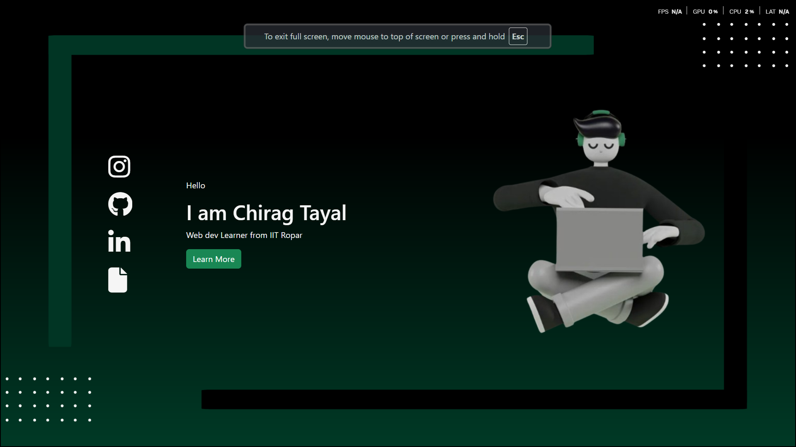
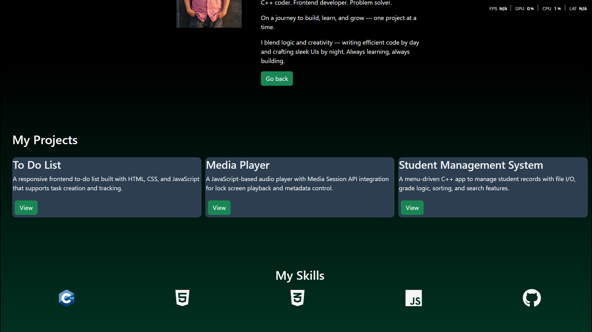
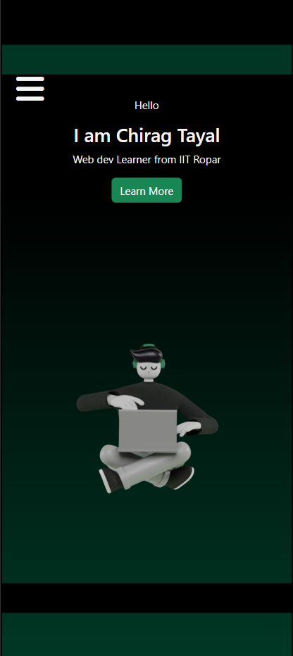
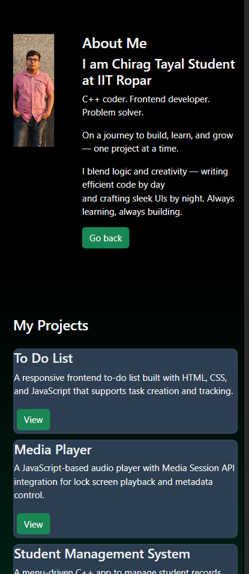

# 🌐 Personal Portfolio Website

This is a responsive personal portfolio website built using **HTML**, **CSS**, **JavaScript**, and **Bootstrap 5.3**. It showcases my profile, skills, projects, and contact information.

---

## 🚀 Features

- 🧑‍💻 Clean and modern **landing page** with intro
- 🔗 **Social media icons** using Font Awesome
- 📂 **Projects section** displaying major work
- 🧠 **Skills section** for technologies I know
- 📱 **Responsive layout** for desktop, tablet, and mobile
- 🎨 Minimal and elegant design with animations

---

## 🛠️ Tech Stack

| Category      | Technologies Used                   |
|---------------|-------------------------------------|
| 🌐 Markup     | HTML5                               |
| 🎨 Styling    | CSS3, Bootstrap 5.3                 |
| ⚙️ Behavior   | JavaScript (Vanilla)                |
| 🎭 Icons      | Font Awesome                        |
| 🧩 Layout     | Flexbox, CSS Grid                   |

---

## 📸 Screenshots

### 🖥️ Desktop View

#### 🔹 Landing Page

#### 🔹 Second Page

---

### 📱 Mobile View

#### 🔹 Mobile - Landing Page

#### 🔹 Mobile - Second Page

